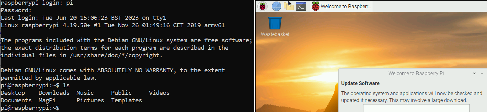

# Qemu - PI Emulator

## Overview
- `qemu` can be used to emiulate Raspberry Pi on Windows 10.

## Installation
- `Download qemu` for Windows 10 from [here](https://qemu.weilnetz.de/w64/2023/qemu-w64-setup-20230531.exe) and install. This will install and create `c:\Program Files\qemu\qemu-system-arm.exe`
- `Download Kernel` from [here](https://github.com/dhruvvyas90/qemu-rpi-kernel/blob/master/kernel-qemu-4.19.50-buster)
- `Download Compiled device tree file (.dtb)` from [here](https://github.com/dhruvvyas90/qemu-rpi-kernel/blob/master/versatile-pb-buster.dtb)
- `Download Raspbian OS` from [here](http://downloads.raspberrypi.org/raspbian/images/raspbian-2020-02-14/2020-02-13-raspbian-buster.zip). Extract the zip file and extract `2020-02-13-raspbian-buster.img`
- `Download BIOS EFI` from [here](https://releases.linaro.org/components/kernel/uefi-linaro/16.02/release/qemu64/QEMU_EFI.fd)
- `Download Oracle OLE9 for Pi` from [here](https://www.oracle.com/linux/downloads/linux-arm-downloads.html)
- Create a folder `D:\MyDev\pi\QEMU` or equivalent. Place all the above files.
  - For Pi 32 Bit 
    - Create `start.bat` with below commands
      ```bat
      "c:\Program Files\qemu\qemu-system-arm.exe" ^
      -kernel "D:\MyDev\pi\QEMU\kernel-qemu-4.19.50-buster" ^
      -cpu arm1176 ^
      -m 256 ^
      -M versatilepb ^
      -serial stdio ^
      -dtb "D:\MyDev\pi\QEMU\versatile-pb-buster.dtb" ^
      -append "root=/dev/sda2 panic=1 rootfstype=ext4 rw" ^
      -hda "D:\MyDev\pi\QEMU\2020-02-13-raspbian-buster.img" ^
      -net nic ^
      -net user,hostfwd=tcp::5022-:22 ^
      -no-reboot 
      ```
    - Login to terminal with username/password = `pi/raspberry`   
      
  - For Arm64 Linux
    - Create `start_arm64_disk.bat` with below commands
      ```bat
      ```
    - Create `start_arm64.bat` with below commands
      ```bat
      ```
  
## Reference
- **Emulator - QEMU -** [Wiki](https://wiki.qemu.org/Main_Page) ,[Download](https://qemu.weilnetz.de/w64/2023/?C=M;O=D)
- [Medium Pi System Emulation](https://raduzaharia.medium.com/system-emulation-using-qemu-raspberry-pi-4-and-efi-87652ff203b7)